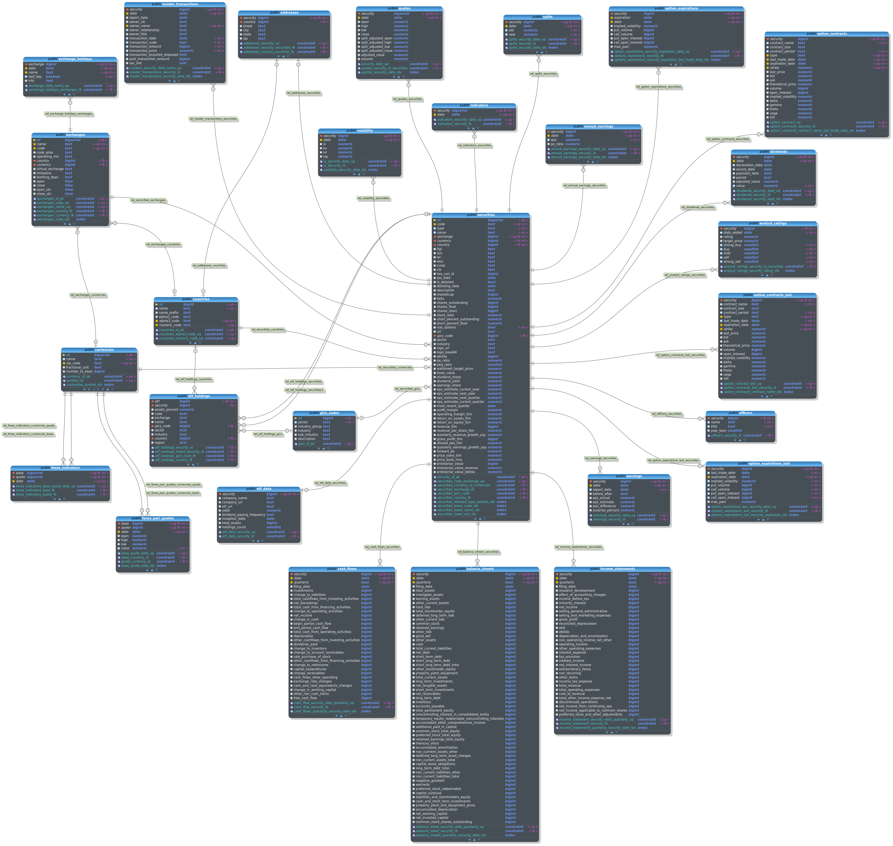

<p align="center">
    
</p>

# Ascentrade Database Schema

This repository provides the PostgreSQL database schema used for the Ascentrade backend.

## Tools

We use [pgModeler](https://pgmodeler.io/) to create the database initialization file.
You can run pgModeler using our [Docker image](https://github.com/Ascentrade/pgmodeler-container)!

## Data

The database comes with the following prefilled tables.
- `countries`
- `currencies`
- `exchanges`
- `gics`

### Indicators

To automatically store indicator data, alter the `indicator` table in the following way:

```sql
-- Add new columns
ALTER TABLE indicators ADD COLUMN IF NOT EXISTS column_name INTEGER;
ALTER TABLE indicators ADD COLUMN IF NOT EXISTS column_name BOOLEAN;
ALTER TABLE indicators ADD COLUMN IF NOT EXISTS column_name DATE;
ALTER TABLE indicators ADD COLUMN IF NOT EXISTS column_name NUMERIC(10,4);

-- Drop any old columns
ALTER TABLE indicators DROP COLUMN IF EXISTS column_name;

-- Delete all calculated indicator values
DELETE FROM indicators;
```

### Structure

pgModeler generates a [detailed database documentation](database.html).



## Contributing

We encourage public contributions! Please review [CONTRIBUTING.md](https://github.com/Ascentrade/docs/blob/main/CONTRIBUTING.md) for details.

## License

<p align="center">
    
</p>

```
Copyright (C) 2024 Dennis Greguhn and Pascal Dengler

This program is free software: you can redistribute it and/or modify
it under the terms of the GNU Affero General Public License as
published by the Free Software Foundation, either version 3 of the
License, or (at your option) any later version.

This program is distributed in the hope that it will be useful,
but WITHOUT ANY WARRANTY; without even the implied warranty of
MERCHANTABILITY or FITNESS FOR A PARTICULAR PURPOSE.  See the
GNU Affero General Public License for more details.

You should have received a copy of the GNU Affero General Public License
along with this program.  If not, see <https://www.gnu.org/licenses/>.
```

See [LICENSE](./LICENSE) for more information.
